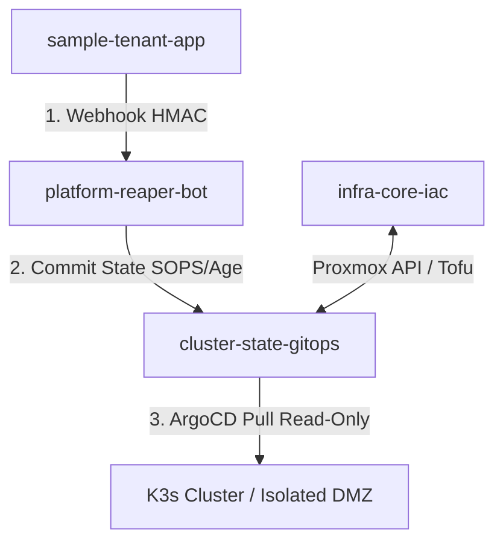

# Alcambic - Ephemeral Preview Environment Platform (IDP)

An automated, GitOps-driven Internal Developer Platform (IDP) engineered to provision fully isolated, ephemeral Kubernetes preview environments per Pull Request. Designed to reduce CI/CD feedback loops and eliminate staging server cloud waste through aggressive FinOps resource reclamation.

## Platform Evolution & Status

| Phase | Target Scope | Current Status |
| :--- | :--- | :--- |
| **Phase 1.1** | Proxmox Host Hardening, DMZ Network, K3s Cluster | 🟢 **In Progress (Current MVP)** |
| **Phase 1.2** | Ephemeral VMs via OpenTofu & Ansible testing | ⚪ *Planned* |
| **Phase 2.0** | Hexagonal Architecture Control Plane Refactoring | ⚪ *Planned* |

## Architecture & Separation of Duties (SoD)

To enforce strict **Zero Trust** security boundaries and prevent unauthorized privilege escalation, the platform decouples application workloads, cluster state, and bare-metal hypervisor infrastructure across five specialized repositories:

## Repository Ecosystem

| Repository | Layer | Purpose & Technology Stack |
| :--- | :--- | :--- |
| **[.github](https://github.com/preview-env-idp/.github)** | Control Plane | Global organization profile, security baselines, and compliance governance. |
| **[infra-core-iac](https://github.com/preview-env-idp/infra-core-iac)** | Underlay / Layer 1 | Proxmox VE bare-metal hardening, Linux L2/L3 network isolation, `nftables` firewalls, and **OpenTofu** virtualization provisioning. |
| **[cluster-state-gitops](https://github.com/preview-env-idp/cluster-state-gitops)** | Overlay / SSOT | Single Source of Truth for **ArgoCD**. Contains Kubernetes manifests, Helm charts, and **SOPS + Age** encrypted secrets. Read-only for cluster controllers. |
| **[platform-reaper-bot](https://github.com/preview-env-idp/platform-reaper-bot)** | Automation / FinOps | Custom operator (Go/Python) handling GitHub webhook events, SoD enforcement, and rolling TTL lifecycle management (Reaper). |
| **[sample-tenant-app](https://github.com/preview-env-idp/sample-tenant-app)** | Tenant Workload | A sample microservice application utilized to trigger and validate automated preview environment deployments. |

## How to deploy the platform

1. **Proxmox Installation:** You must have Proxmox VE installed on your bare-metal machine. If you have not done this yet, follow the official guide: https://www.proxmox.com/en/products/proxmox-virtual-environment/get-started
2. **Next Steps:** Navigate to Runbook 001 in this repository and execute the initial bootstrapping instructions (`.github/docs/02-runbooks/001-ssh-keys.md`).
